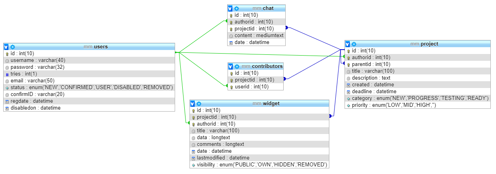

## ManagerMaximus

### Group members
 * Garai Adam
 * Herczog Attila
 * Naszradi Mihaly
 * Vass Mark Benjamin

### Description

ManagerMaximus is a free and open source, web-based project management and issue tracking tool. It allows users to manage multiple projects and associated subprojects. It features per project wikis and forums, time tracking, and flexible, role-based access control. It includes a calendar, chat for projects.

### Features

* Registartion and login system
* Project creating system
* Invite people to projects
* Subprojets creating
* TODO list
* Widget based content uploading
* Chat for individual projects
* Deadline calendar
* Email notifications
* Comment section on widgets

### Future plans
* Tagging users in comments and posts
* Mobile port
* customizeable menu structure
* Charts about the statistics

### Used technologies
* AngularJS
* PrimeNG
* NodeJS
* MySQL
* Rest API

### Database

You can generate database with `Backend/SQL/generate_db.sql` file.
This SQL will make the database, datatables, table connections and one database user.
You can connect to the database called `manager_maximus` with username `manager_maximus` and password `3Pi14159265`.

### Status
- [ x ] Registartion and login system
- [ x ] Project creating system
- [ x ] Invite people to projects
- [ x ] Subprojets creating
- [ ] TODO list
- [ x ] Widget based content uploading
- [ ] Chat for individual projects
- [ ] Deadline calendar
- [ ] Email notifications
- [ ] Comment section on widgets
